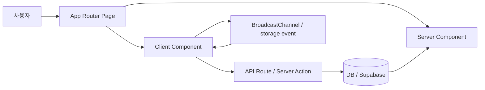

# ARCHITECTURE — my-first-web

## 1. 프로젝트 목표

- 개인 블로그를 App Router, Server Components, Tailwind CSS, shadcn/ui 중심으로 구성한다.
- 현재는 로컬 데이터로 빠르게 개발하고, 이후 Supabase 또는 PostgreSQL 기반 영속 저장소로 확장한다.
- 읽기 중심 블로그 경험에 더해 글 작성, 검색, 삭제, 향후 인증과 권한 제어까지 담을 수 있는 구조를 만든다.

## 2. 페이지 맵

### 2.1 현재/핵심 페이지

- `/` — 홈
  - 블로그 소개, 최근 글, 주요 CTA
- `/posts` — 포스트 목록
  - 검색, 삭제, 카드형 리스트
- `/posts/[id]` — 포스트 상세
  - 단일 글 본문, 메타 정보, 뒤로가기
- `/posts/new` — 포스트 작성
  - 제목/작성자/내용 입력, 저장, 브로드캐스트 동기화

### 2.2 확장 예정 페이지

- `/login` — 로그인
- `/signup` — 회원가입
- `/mypage` — 마이페이지
- `/admin` — 관리 영역(선택)

### 2.3 App Router 폴더 구조

| URL | 파일 |
| --- | --- |
| `/` | `app/page.tsx` |
| `/posts` | `app/posts/page.tsx` |
| `/posts/[id]` | `app/posts/[id]/page.tsx` |
| `/posts/new` | `app/posts/new/page.tsx` |
| `/login` | `app/login/page.tsx` |
| `/signup` | `app/signup/page.tsx` |
| `/mypage` | `app/mypage/page.tsx` |

## 3. 유저 플로우

### 3.1 글 읽기

1. 사용자가 `/` 또는 `/posts`에 들어온다.
2. 최근 글이나 전체 글 목록을 본다.
3. 카드 클릭으로 `/posts/[id]` 상세로 이동한다.
4. 뒤로가기 또는 목록 링크로 돌아온다.

### 3.2 글 작성

1. 사용자가 `/posts/new`에 들어온다.
2. 제목, 작성자, 내용을 입력한다.
3. 저장 시 API로 전송하고 성공하면 `/posts`로 이동한다.
4. 다른 탭은 BroadcastChannel 또는 localStorage storage 이벤트로 목록을 갱신한다.

### 3.3 관리 흐름

1. 로그인한 사용자가 마이페이지 또는 작성 기능에 접근한다.
2. 본인 글 수정/삭제, 프로필 확인, 권한별 기능 노출을 처리한다.
3. 이후 Supabase RLS로 서버 권한을 강제한다.

## 4. 컴포넌트 계층

### 4.1 레이아웃 계층

- `app/layout.tsx`
  - 전역 네비게이션, 공통 푸터, 콘텐츠 래퍼
- `app/globals.css`
  - shadcn/ui 테마 변수, 디자인 토큰, 전역 배경과 타이포그래피

### 4.2 페이지 계층

- `app/page.tsx`
  - 홈 소개, 최근 글, CTA
- `app/posts/page.tsx`
  - `PostsClient`를 통해 목록/검색/삭제 UI 렌더링
- `app/posts/[id]/page.tsx`
  - 단일 포스트 상세 보기
- `app/posts/new/page.tsx`
  - 작성 폼과 저장 요청 처리

### 4.3 도메인 컴포넌트 계층

- `components/PostsClient.tsx`
  - 포스트 상태 관리, 검색, 삭제, 실시간 동기화 수신
- `components/PostCard.tsx`
  - 카드 UI와 삭제 버튼
- `components/SearchBar.tsx`
  - 검색어 입력, 결과 필터링, 선택적 결과 숨김
- `components/mockups/NewPostMock.tsx`
  - 문서/실습용 작성 UI 샘플

### 4.4 디자인 시스템 계층

- `components/ui/Button.tsx`
  - 주요 액션, 이동, 저장 버튼
- `components/ui/Card.tsx`
  - 글 요약, 섹션 묶음, 정보 카드
- `components/ui/Input.tsx`
  - 제목, 작성자, 검색어 입력
- `components/ui/Dialog.tsx`
  - 삭제 확인, 경고, 확인 단계
- `lib/utils.ts`
  - `cn()` 헬퍼, className 병합

## 5. 데이터 흐름



### 현재 데이터 흐름

- 현재 `lib/posts.ts`의 로컬 배열이 초기 데이터 소스다.
- `/posts`는 서버에서 초기 데이터를 받아 `PostsClient`로 넘긴다.
- `/posts/new`는 `POST /api/posts`로 저장 요청을 보낸다.
- 성공 시 다른 탭은 BroadcastChannel 또는 localStorage 기반 이벤트로 동기화한다.

## 6. 데이터 모델

### 6.1 현재 로컬 모델

```ts
export type Post = {
  id: number
  title: string
  content: string
  author?: string
  date: string
}
```

### 6.2 목표 DB 모델

#### users

- `id`: uuid, primary key
- `email`: text, unique
- `name`: text
- `avatar_url`: text, nullable
- `role`: enum or text (`user`, `admin`, `author`)
- `created_at`: timestamptz
- `updated_at`: timestamptz

#### posts

- `id`: uuid, primary key
- `user_id`: uuid, foreign key -> `users.id`
- `title`: text
- `slug`: text, unique
- `content`: text
- `excerpt`: text, nullable
- `status`: text or enum (`draft`, `published`, `archived`)
- `published_at`: timestamptz, nullable
- `created_at`: timestamptz
- `updated_at`: timestamptz
- `deleted_at`: timestamptz, nullable

#### tags (선택)

- `id`: uuid, primary key
- `name`: text
- `slug`: text, unique

#### post_tags (선택)

- `post_id`: uuid, fk -> `posts.id`
- `tag_id`: uuid, fk -> `tags.id`

### 6.3 관계

- 한 명의 `user`는 여러 개의 `post`를 작성할 수 있다. `users (1) -> posts (N)`.
- `post`와 `tag`는 다대다 관계다. 필요 시 `post_tags` 조인 테이블로 연결한다.

### 6.4 인덱스 계획

- `posts.slug` unique index
- `posts.user_id` index
- `posts.published_at` index
- `posts.status` index
- 검색용 full-text index는 PostgreSQL `tsvector` + `GIN` 고려

## 7. 컴포넌트 API 초안

### 7.1 `PostCard`

```ts
type PostCardProps = {
  post: {
    id: number
    title: string
    content: string
    author?: string
    date: string
  }
  showDelete?: boolean
  onDelete?: (id: number) => void
}
```

### 7.2 `SearchBar`

```ts
type SearchBarProps = {
  value?: string
  onChange?: (value: string) => void
  onSearch?: (query: string) => void
  onDelete?: (id: number) => void
  hideResults?: boolean
}
```

### 7.3 `NewPostForm`

```ts
type NewPostInput = {
  title: string
  author?: string
  content: string
}
```

## 8. 디자인 토큰

- 메인 컨테이너: `max-w-4xl mx-auto`
- 세로 간격: `space-y-6`
- 카드: `p-6`, `rounded-lg`, `shadow-sm`
- 배경과 텍스트 색상은 `app/globals.css`의 CSS 변수 사용
- Tailwind의 기본 파랑 계열 직접 사용보다 토큰 우선

## 9. 구현 우선순위

1. 현재 페이지 구조 유지하면서 shadcn/ui 컴포넌트 적용을 안정화한다.
2. 로컬 `Post` 모델을 DB 모델과 맞춰 정리한다.
3. Prisma 또는 Supabase 스키마로 이전할 준비를 한다.
4. 인증, 권한, RLS, 댓글 등 확장 기능을 차례대로 추가한다.
