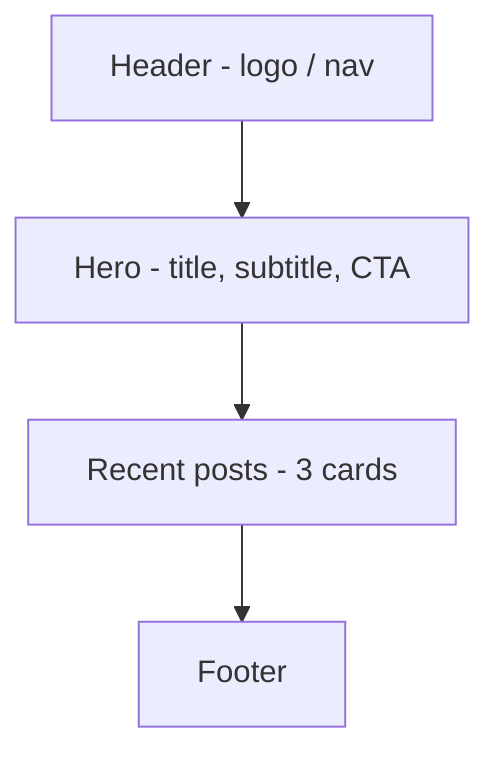

# Wireframe — Home

목적: 사이트 첫 진입 화면. 소개(Hero)와 최근 포스트 요약을 보여주고, 주요 탐색으로 `/posts`와 `/posts/new`로 유도.

구성(데스크톱 우선)

요소별 메모
- Header: 사이트 타이틀 좌측, 우측에 링크 `Home / Posts / New` (반응형: 모바일은 햄버거)
- Hero: `max-w-4xl mx-auto` 중앙 정렬, CTA는 `Button(Primary)`
- Recent posts: 그리드(`grid-cols-1 md:grid-cols-3`), 각 카드에 타이틀/요약/작성일
- Footer: 저작권, 소셜 링크

모바일 고려
- Hero 텍스트는 축약, 카드는 1열 스택
- 터치 영역 충분히 확보(p-4 이상)

디자인 토큰 힌트
- 컨테이너: `max-w-4xl mx-auto p-4`
- 카드: `p-6 rounded-lg shadow-sm bg-[var(--card-bg)]`
