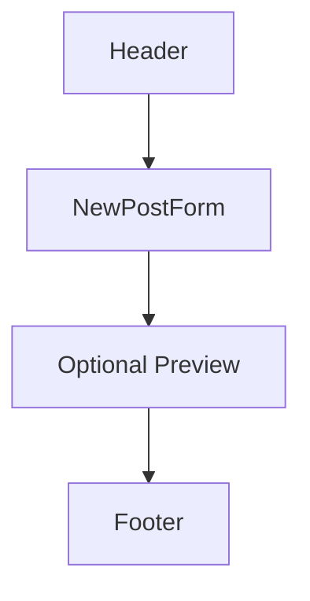

# Wireframe — New Post

목적: 사용자가 새 포스트를 작성하고 저장(임시/서버)하는 폼 화면.

구성

폼 필드
- `Title` (Input, required)
- `Content` (Textarea, required)
- `Author` (Input, optional)
- `저장` `취소` 버튼(Primary/Secondary)

동작
- 클라이언트 유효성 검사 후 Server Action 또는 API 호출로 저장
- 저장 성공 시 `/posts`로 리다이렉트

UX 힌트
- 입력 중 자동 임시저장(LocalStorage) 고려(네트워크 장애 대비)
- 다이얼로그(`Dialog`)로 저장 확인 또는 에러 표시
