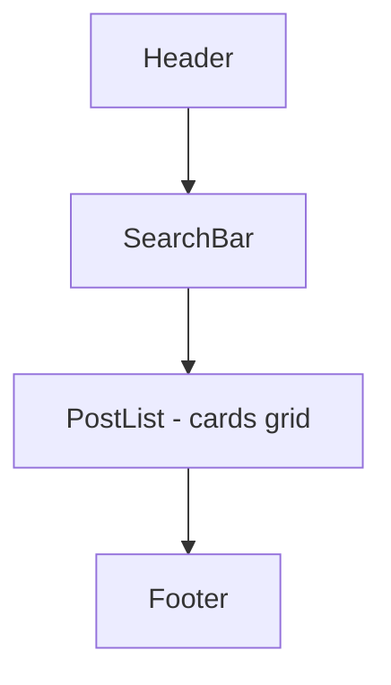

# Wireframe — Posts List

목적: 포스트 검색/필터/목록 제공, 각 카드에서 상세로 이동하거나 삭제 가능.

구성

요소별 메모
- SearchBar: 입력 + 검색 버튼, 결과는 클라이언트 필터로 즉시 반영
- PostCard: `title, excerpt, meta, actions(보기/삭제)`
- Grid: `grid-cols-1 md:grid-cols-2` 기본, 카드 간격 `gap-6`

상호작용
- 검색 제출 또는 입력 시 클라이언트 필터링
- 삭제: `confirm` 후 상태에서 제거(서버 연동 시 API 호출)

접근성
- 검색은 `role=search`, 버튼에 `aria-label` 명시
